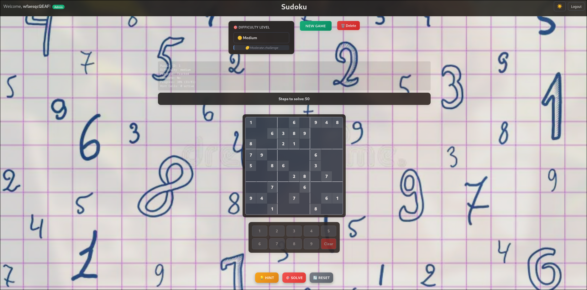

# Lab 7 - Back-end: Sudoku API

## 📌 Overview

This project provides a CRUD API for managing Sudoku puzzles, based on the entities from Lab 6. The backend is implemented using **JavaScript** and **SQLite**, with JWT-based authentication and role/permission-based access control.

The frontend is built with **React**, integrated with the backend via a **REST API**. Swagger UI is available for interactive documentation.



---

## 🔐 Authentication & Roles

JWT is required to access all puzzle-related routes.

JWT includes:
- **Permissions** (`["READ", "WRITE", "DELETE"]`)
- **Role** (`"ADMIN"`, `"MEMBER"`, `"VISITOR"`)  
- **Expires in 1 minute** (for demo purposes)

### Role Capabilities

| Role     | Can Generate | Can Solve | Can Delete | Can Create |
|----------|--------------|-----------|------------|------------|
| **Admin**   | ✅           | ✅        | ✅         | ✅         |
| **Member**  | ✅           | ✅        | ❌         | ✅         |
| **Visitor** | ✅           | ❌        | ❌         | ✅         |

---

## 📦 Endpoints

### 🔐 Auth
- `POST /api/auth/register` – Register a new user
- `POST /api/auth/login` – Log in and receive a JWT
- `POST /api/auth/token/verify` – Verify token validity

### 🧩 Puzzles
- `GET /api/puzzles` – List puzzles with pagination and filtering
- `POST /api/puzzles` – Create a new puzzle
- `GET /api/puzzles/{id}` – Get puzzle by ID
- `PUT /api/puzzles/{id}` – Update a puzzle
- `DELETE /api/puzzles/{id}` – Delete a puzzle
- `POST /api/puzzles/generate` – Generate a random puzzle
- `POST /api/puzzles/{id}/solve` – Solve a puzzle
- `POST /api/puzzles/{id}/validate` – Validate move/state

### ⚙️ Health
- `GET /health` – API health check

✅ Swagger UI is used for API documentation.

### 🔎 Swagger UI


---

## 🧠 Database Schema (SQLite)

### `users`
- `id`
- `username`
- `password`
- `role`
- `created_at`

### `puzzles`
- `id`
- `difficulty`
- `puzzle`
- `solution`
- `created_by`
- `created_at`
- `updated_at`

---

## 🚀 Run Instructions

### 🔧 Backend

```bash
cd backend
npm install
npm run dev
```

###  💻 Frontend
```bash
# from project root
npm install
npm run start